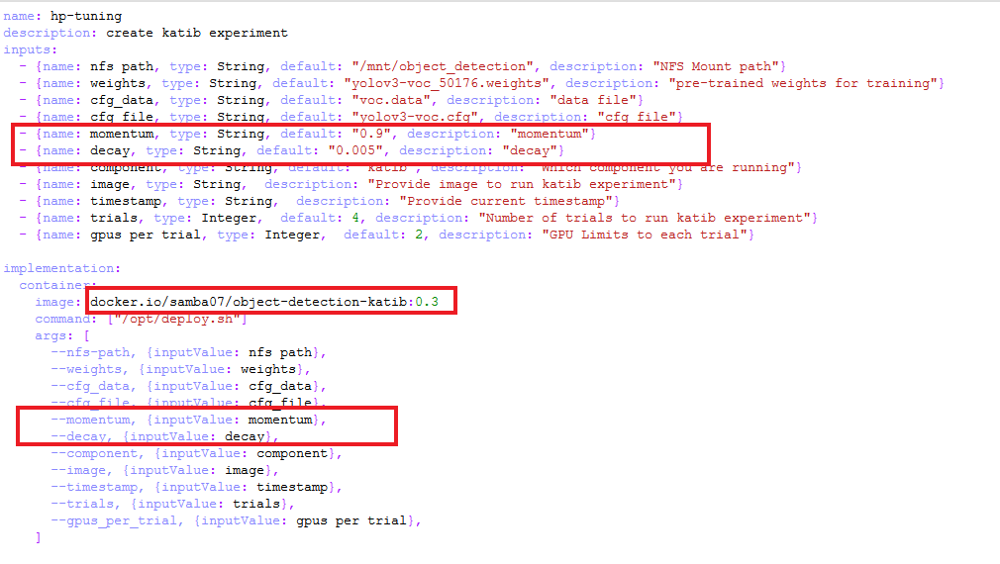

# **Custom HP tuning with Katib for Object Detection Pipeline**

## <a name='Introduction'></a>**Introduction**

Currently, Katib Hyperparameter tuning (HP) for object detection pipeline is done considering two parameters:

* Momentum
* Decay

The hyperparameters and the number of hyperparameters to be tuned can be modified as per requirement. 

## <a name='Procedure'></a>**Custom HP Tuning Procedure**

- Open source component deployment shell script named ```deploy.sh``` present in ```src``` folder of [Katib component](./components/v2/katib).

- Add the part of YAML configuration required for the new desired hyperparameter under ```parameters:``` tag similar to the existing as shown below:


- Declare the desired hyperparameters as ```do while``` cases in the same file as shown.


- Open ```components.yaml``` of [Katib component](./components/v2/katib), and add the required configuration as shown below under ```inputs:``` tag & the ```args:``` tag under ```implementation:``` tag.



- Build Docker image for [Katib component](./components/v2/katib) & provide the resulting image name in ```component.yaml``` in the location as shown above.

Katib component with customized HP tuning is ready to be used in object detection pipeline.
