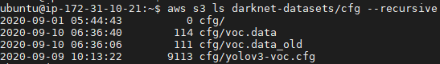
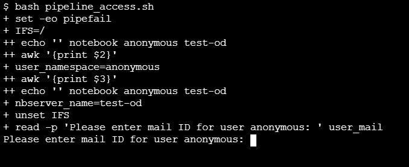

# **Object Detection Workflow using Kubeflow Pipeline**

<!-- vscode-markdown-toc -->
* [Object Detection Workflow](#Workflow)
* [Infrastructure Used](#InfrastructureUsed)
* [Prerequisites](#Prerequisites)
* [S3 Bucket Layout](#AWSSetup)
    * [Datasets](#DatasetFolder) 
* [UCS Setup](#UCSSetup)
    * [Install Kubeflow](#InstallKubeflow)
	* [Install NFS server (if not installed)](#InstallNFS)
		* [Retrieve Ingress IP](#RetrieveIngressIP)
		* [Install NFS server, PVs and PVCs](#InstallNFSserverPV)
    * [Create Jupyter Notebook Server](#CreateJupyterNotebookServer)
	* [Prerequisites for Pipeline execution](#pipelineprerequisite)
	    * [RBAC configuration application](#pipelineaccess)
		* [Setup private Docker registry auth](#Privatedocker)
		* [Create Kubernetes secret](#KubernetesSecret)
		* [Create Label for Kubeflow namespace](#CreateLabel)
	* [Upload Object Detection Pipeline Notebook file](#UploadNotebookfile)
	* [Run Object Detection Pipeline](#RunPipeline)
	* [KF Pipeline Dashboard](#PipelineDashboard)
	* [Katib Dashboard](#KatibDashboard)
    * [Additional features with Darknet training](#FeatureswithDarknettraining)
        * [Dynamic mAP chart](#Dynamicplot)
        * [Static mAP chart](#Staticplot)
        * [Virtual service implementation](#Virtualservice)            
	* [Model Inference](#Inferencing)
<!-- vscode-markdown-toc-config
	numbering=false
	autoSave=true
	/vscode-markdown-toc-config -->
<!-- /vscode-markdown-toc -->

## <a name='Workflow'></a>**Object Detection Workflow**

* Download datasets, darknet config & weights from object storage.  
* Hyperparameter tune the darknet model. 
* Train an object detection model using darknet with best hyperparameters.  
* Convert the darknet model/weights to tflite and upload to object storage.  
* Serve tflite model using Kubeflow pipeline.  
* Perform prediction for a client image request through Jupyter-notebook.


## <a name='InfrastructureUsed'></a>**Infrastructure Used**

Either of the following infrastructure is used.

* Cisco UCS - C240M5
* Cisco UCS - C480ML

## <a name='Prerequisites'></a>**Prerequisites**

* UCS machine with [Kubeflow](https://www.kubeflow.org/) v1.1.0 installed
* S3 bucket with read/write permissions & with specified layout

## <a name='AWSSetup'></a>**S3 Bucket Layout**

Ensure that required darknet configuration files ( .cfg & .data ) are in *cfg* directory, dataset & annotation files (in .tar format) in the *datasets* directory, object classes file (in .name format) and metadata files ( which contains relative paths of JPG image files) in *metadata* directory, trained weights files in *pre-trained-weights* directory of the S3 bucket as shown below, for successful training and subsequent inferencing





### <a name='DatasetFolder'></a>**Datasets**

Datasets folder should contain

- Dataset files in tarball ( can be one or more).

- Each tarball should comprise of a folder within which sets of images (.jpg format) & their corresponding annotated files (.txt format) as shown below.


### **Note**:

After the pipeline execution is complete, a backup folder with trained darknet weights (in .weights) and model folder (with .tflite) are pushed to S3 bucket. The stored tflite model or darknet weights can be utilized for future inferencing.

## <a name='UCSSetup'></a>**UCS Setup**

### <a name='InstallKubeflow'></a>**Install Kubeflow**

To install Kubeflow, follow the instructions from [here](../../../../../install)

### <a name='InstallNFS'></a>**Install NFS server (if not installed)**

To install NFS server please follow steps below.

#### <a name='RetrieveIngressIP'></a>*Retrieve Ingress IP*

For installation, we need to know the external IP of the ```istio-ingressgateway``` service. This can be retrieved by the following steps.  

```
kubectl get service -n istio-system istio-ingressgateway
```

If your service is of LoadBalancer Type, use the ```EXTERNAL-IP``` of this service.  

Or else, if your service is of NodePort Type - run the following command:  

```
kubectl get nodes -o wide
```

Use either of ```EXTERNAL-IP``` or ```INTERNAL-IP``` of any of the nodes based on which IP is accessible in your network.  

This IP will be referred to as INGRESS_IP from here on.

#### <a name='InstallNFSserverPV'></a>*Install NFS server, PVs and PVCs*

Refer [here](../../../../../install/nfs_setup) to install NFS server, PVs and PVCs.


### <a name='CreateJupyterNotebookServer'></a>**Create Jupyter Notebook Server**

Follow the [steps](../notebook#create--connect-to-jupyter-notebook-server) to create & connect to Jupyter Notebook Server in Kubeflow

### <a name='pipelineprerequisite'></a>**Prerequisites for Pipeline execution**

#### <a name='pipelineaccess'></a>***Apply RBAC configuration application from notebook server***

Once the notebook server is created, it is essential to apply certain RBAC related configurations to it for successful execution of KF pipeline. This includes creating ```serviceRoleBinding``` and ```envoyFilter```.

Open the ```terminal``` of your notebook server and execute ```pipeline_access.sh``` using:

```
bash pipeline_access.sh
```

You will be prompted to enter the user mail ID of your usernamespace as shown below.



**Note:** Please enter the same user mail ID which was provided during user profile creation using [nfs_setup](../../../../../install/nfs_setup).

#### <a name='Privatedocker'></a>***Setup private Docker registry authentication***

To authenticate the pull of Docker images from your private Docker registry, Docker credentials are applied on the service account ```default-editor`` of the specific namespace, which will be directly effect image pulls of pipeline components running in the namespace.  

```
kubectl create secret docker-registry docker-cred --docker-server=<<docker server URL>> --docker-username=<<username>> --docker-password=<<password>> -n <<user-namespace>>

kubectl patch serviceaccount default-editor -p '{"imagePullSecrets": [{"name": "docker-cred"}]}' -n <<user-namespace>>
```

#### <a name='KubernetesSecret'></a>***Create Kubernetes secret to access S3***

Create secret for AWS_ACCESS_KEY_ID, AWS_SECRET_ACCESS_KEY along with kubeflow deployment to access S3 bucket.

It is a one time creation and will be used by dataset download & model conversion components of the pipeline.

Export the AWS credentials

```
 export AWS_ACCESS_KEY_ID = <<Your AWS access key ID>>
 export AWS_SECRET_ACCESS_KEY = <<Your AWS secret access key>>
```
Change access key id and secret access key to base64

```
echo -n $AWS_ACCESS_KEY_ID | base64
<<converted base64 AWS access key id>>

echo -n $AWS_SECRET_ACCESS_KEY | base64
<<converted base64 AWS secret access key>>
```
Create a YAML file (aws-secret.yaml) with the below content & provide base64-converted ID and key in it as shown

```yaml
apiVersion: v1
kind: Secret
metadata:
  name: aws-secret
  namespace: kubeflow
type: Opaque
data:
  AWS_ACCESS_KEY_ID: <<BASE64_CONVERTED_AWS_ACCESS_KEY_ID>>
  AWS_SECRET_ACCESS_KEY: <<BASE64_CONVERTED_AWS_SECRET_ACCESS_KEY>>
```
Create kubernetes secret on UCS by applying the above YAML file

```
kubectl apply -f aws-secret.yaml
```
Verify whether secret is created

```
kubectl get secrets -n kubeflow | grep aws-secret
```

### <a name='CreateLabel'></a>**Create Label for Kubeflow namespace**

A namespace label 'serving.kubeflow.org/inferenceservice=enabled' is set to Kubeflow namespace for inference purpose.

```
kubectl label namespace kubeflow serving.kubeflow.org/inferenceservice=enabled
```

### **Note**:

The base docker image used for building training component image may vary based on the compute capability of GPUs running on UCS server.

Please replace the base docker image based on GPU model [here](./components/v2/train/Dockerfile) and build a docker image.
Replace the image field [in here](./components/v2/train/component.yaml) with the built image.

- ```NVIDIA V100``` GPU - base image to be used ```daisukekobayashi/darknet:gpu-cv-cc75```

- ```Tesla P100``` GPU - base image to be used ```daisukekobayashi/darknet:gpu-cv-cc60```

### <a name='UploadNotebookfile'></a>**Upload Object Detection Pipeline Notebook file**

Upload [object-detection-pipeline-deployment.ipynb](object-detection-pipeline-deployment.ipynb)

### <a name='RunPipeline'></a>**Run Object Detection Pipeline**

Open the uploaded notebook and start executing cells, screenshots of which are captured below.


*Once the pipeline is executed, a run link will be generated and displayed. 
If you click the link, you will directed to Kubeflow Pipeline Dashboard*

### <a name='PipelineDashboard'></a>**KF Pipeline Dashboard**

Click on the latest experiment which is created


Pipeline components screenshots & logs can be viewed as below


### <a name='KatibDashboard'></a>**Katib dashboard**

To track HP tuning created by pipeline, you need to go Katib dashboard from KF Central dashboard's left panel. 
Currently, the hyperparameters chosen are momentum and decay.

#### **Note**:
To customize the hyperparameters used for tuning, refer [here](./Katib.md).

### <a name='FeatureswithDarknettraining'></a>**Additional features with Darknet training**

Certain features have been added to the training component of this pipeline to aid your darknet model training to be better and safe. They are mentioned as below along with usage.

#### <a name='Dynamicplot'></a>***Dynamically plotted loss cum mAP(Mean Average Precision) chart***

Darknet training is visualised on-the-fly by plotting average loss and accuracy mAP(Mean Average Precision) values against the number of iterations. It helps in tracking the training trajectory and taking the required actions in case of any discrepancy noticed during on-going training.

##### How to access the dynamic mAP chart

* The chart can be accessed only during the execution of the training component. Start running the object detection pipeline and wait reach till the training component execution begins. Sample dynamical mAP chart as shown below.


* The exact URL to access the dynamically plotted mAP chart can be obtained from `access_loss_chart.txt` that will be pushed to S3 bucket just before the start of the actual darknet training as shown below.


* It can also be viewed in the logs of the training component as shown below.


* Basically the URL is of the following format.

 `http://<INGRESS_IP>:<INGRESS_NODEPORT>/<user's namespace>/mapchart/<timestamp of your pipeline run>`

* The dynamic access of the mAP chart will end once the training is done, and the chart will be saved within your timestamp folder. Consequently it will pushed to the S3 bucket.

#### <a name='Staticplot'></a>***Static mAP chart viewing***

This feature enables you to take a look at the completed mAP chart even after the object detection pipeline has completed it's execution. The mAP chart will be a static one.

For more information on how to make use of, please refer [here](object-detection-visualisation/README.md).

#### <a name='Virtualservice'></a>***Virtual service implementation***

This feature enables you to safely view the dynamically plotted mAP chart externally without exposing any node port to outside world. The cluster may prove to be vulnerable to unwanted attacks if in any case the exposed node port or the related service is failed to be deleted after use due to any pipeline related or any other issue.

Virtual service provides a way to utilize the node's ingress IP and ingress nodeport along with a specific URI to view the dynamic chart without exposing any new nodeport.

Implementation of virtual service in training component is shown below:


### <a name='Inferencing'></a>**Model Inference from Notebook**

Create an inference service & check whether it is ready. 
*Note that this will be ready only after the pipeline complete*.


## **Note**:

### How to build component's Docker image 
To build any component docker image in general, go to the [components folder](./components/v2/) and build the respective component's docker image and push into your Docker Hub
