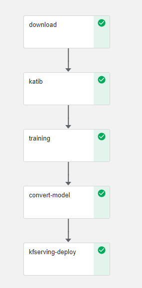
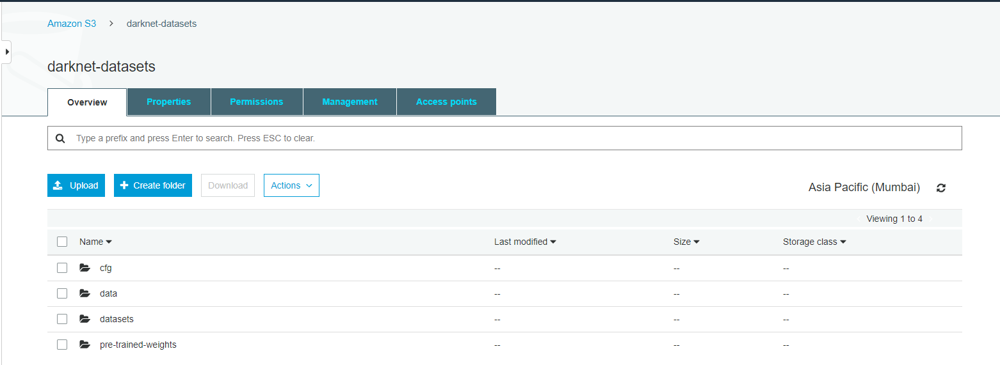
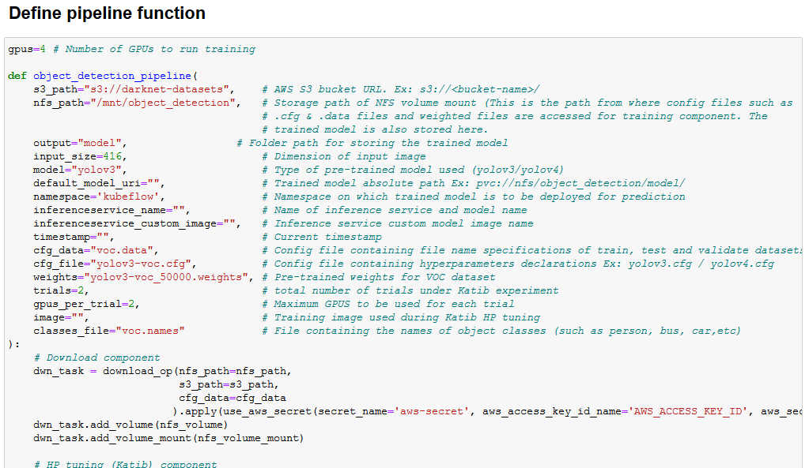
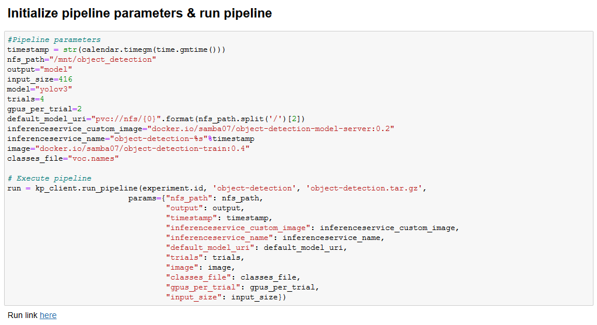

# **Object Detection using Kubeflow Pipeline**

<!-- vscode-markdown-toc -->
* [Problem Definition](#ProblemDefinition)
* [Infrastructure Used](#InfrastructureUsed)
* [Prerequisites](#Prerequisites)
* [AWS Setup](#AWSSetup)
    * [Create AWS Bucket](#CreateBucket)
* [UCS Setup](#UCSSetup)
    * [Install Kubeflow](#InstallKubeflow)
	* [Install NFS server (if not installed)](#InstallNFS)
		* [Retrieve Ingress IP](#RetrieveIngressIP)
		* [Install NFS server, PVs and PVCs](#InstallNFSserverPV)
    * [Create Jupyter Notebook Server](#CreateJupyterNotebookServer)
	* [Create Kubernetes secret](#KubernetesSecret)
	* [Create Label for Kubeflow namespace](#CreateLabel)
	* [Upload Object Detection Pipeline Notebook file](#UploadNotebookfile)
	* [Run Object Detection Pipeline](#RunPipeline)

<!-- vscode-markdown-toc-config
	numbering=false
	autoSave=true
	/vscode-markdown-toc-config -->
<!-- /vscode-markdown-toc -->

## <a name='ProblemDefinition'></a>**Problem Definition**

Download datasets, darknet config from a S3 bucket, train an object detection model using darknet, convert the darknet model/weights to tflite, serve using Kubeflow pipeline; and perform prediction for client request through Jupyter-notebook.



## <a name='InfrastructureUsed'></a>**Infrastructure Used**

* Cisco UCS - C240M5 and C480ML

## <a name='Prerequisites'></a>**Prerequisites**

* UCS machine with [Kubeflow](https://www.kubeflow.org/) 1.0 installed
* AWS account with appropriate permissions

## <a name='AWSSetup'></a>**S3 Bucket file organization**

### <a name='CreateBucket'></a>**Create S3 Bucket**

Create S3 Bucket


### File hierarchy within S3 bucket

Ensure that required darknet configuration files ( .cfg & .data ) are present in cfg directory, dataset files in the datasets directory, trained weights files in pre-trained weights directory of the S3 bucket as shown below, for successful training and subsequent inferencing




## <a name='UCSSetup'></a>**UCS Setup**

### <a name='InstallKubeflow'></a>**Install Kubeflow**

To install Kubeflow, follow the instructions from [here](../../../../../install)

### <a name='InstallNFS'></a>**Install NFS server (if not installed)**

To install NFS server follow steps below.

#### <a name='RetrieveIngressIP'></a>*Retrieve Ingress IP*

For installation, we need to know the external IP of the 'istio-ingressgateway' service. This can be retrieved by the following steps.  

```
kubectl get service -n istio-system istio-ingressgateway
```

If your service is of LoadBalancer Type, use the 'EXTERNAL-IP' of this service.  

Or else, if your service is of NodePort Type - run the following command:  

```
kubectl get nodes -o wide
```

Use either of 'EXTERNAL-IP' or 'INTERNAL-IP' of any of the nodes based on which IP is accessible in your network.  

This IP will be referred to as INGRESS_IP from here on.

#### <a name='InstallNFSserverPV'></a>*Install NFS server, PVs and PVCs*

Follow the [steps](./../install/) to install NFS server, PVs and PVCs.


### <a name='CreateJupyterNotebookServer'></a>**Create Jupyter Notebook Server**

Follow the [steps](./../notebook#create--connect-to-jupyter-notebook-server) to create & connect to Jupyter Notebook Server in Kubeflow

### <a name='KubernetesSecret'></a>**Create Kubernetes secret to access S3**

Create secret for AWS_ACCESS_KEY_ID, AWS_SECRET_ACCESS_KEY along with kubeflow deployment with S3 bucket read/write permissions.

It is a one time creation and will be used by dataset download & model conversion components of the pipeline.

Export the AWS credentials

```
 export AWS_ACCESS_KEY_ID = <<Your AWS access key ID>>
 export AWS_SECRET_ACCESS_KEY = <<Your AWS secret access key>>
```
Change access key id and secret access key to base64

```
echo -n $AWS_ACCESS_KEY_ID | base64
<<converted base64 AWS access key id>>

echo -n $AWS_SECRET_ACCESS_KEY | base64
<<converted base64 AWS secret access key>>
```
Create a YAML file (aws-secret.yaml) with the below content & provide base64-converted ID and key in it as shown

```yaml
apiVersion: v1
kind: Secret
metadata:
  name: aws-secret
  namespace: kubeflow
type: Opaque
data:
  AWS_ACCESS_KEY_ID: <<BASE64_CONVERTED_AWS_ACCESS_KEY_ID>>
  AWS_SECRET_ACCESS_KEY: <<BASE64_CONVERTED_AWS_SECRET_ACCESS_KEY>>
```
Create kubernetes secret on UCS by applying the above YAML file

```
kubectl apply -f aws-secret.yaml
```
Verify whether secret is created

```
kubectl get secrets -n kubeflow | grep aws-secret
```

### <a name='CreateLabel'></a>**Create Label for Kubeflow namespace**

A namespace label 'serving.kubeflow.org/inferenceservice=enabled' is set to Kubeflow namespace for inference purpose.

```
kubectl label namespace seldon serving.kubeflow.org/inferenceservice=enabled
```

### <a name='UploadNotebookfile'></a>**Upload Object Detection Pipeline Notebook file**

Upload [object-detection-pipeline-deployment.ipynb](object-detection-pipeline-deployment.ipynb)

### <a name='RunPipeline'></a>**Run Object Detection Pipeline**

Open the Object-Detection-Pipeline-Deployment.ipynb file and start executing cells

Clone required git repositories


Load Components


Create volume claims & volume mounts


## **Note**:

### Build custom inference service image

The serving component of pipeline needs custom inference docker image for inferencing using tflite model.

To [build](./components/v2/model-server) the docker image and push into your Docker Hub. It will be used when adding a new inference server.

Define pipeline function



Create experiment


Run pipeline



Once the pipeline is executed, a run link will be generated and displayed as output.

Click on the latest experiment which is created 


Pipeline components execution can be viewed as below


Logs of download component


Logs of training component


Logs of model conversion component


Logs of kfserving component


Create an inferenceservice & check whether it is ready


Define functions for dataset pre-processing & prediction


Make prediction


