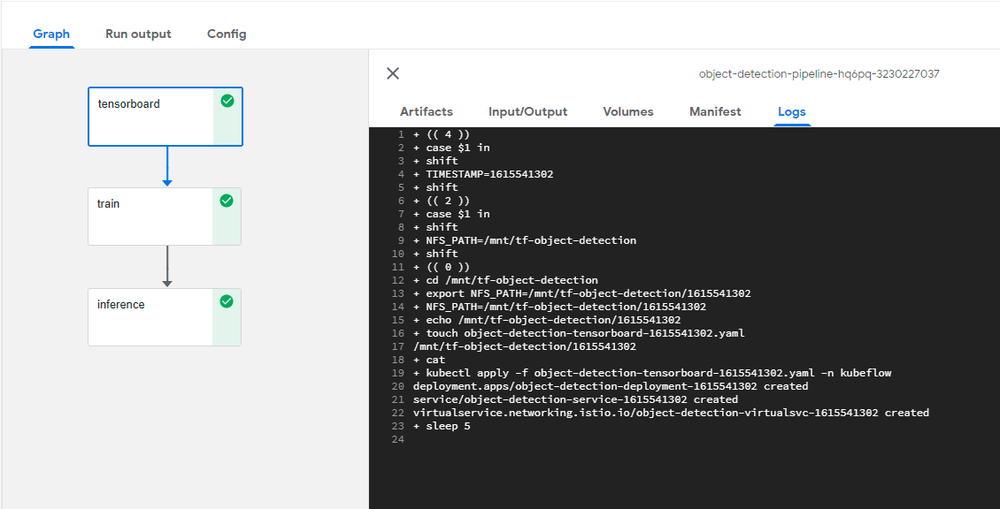

# TensorFlow Object Detection Workflow using Kubeflow Pipeline

Creating accurate machine learning models capable of localizing and identifying multiple objects in a single image remains a core challenge in computer vision. The TensorFlow Object Detection API is an open source framework built on top of TensorFlow that makes it easy to construct, train and deploy object detection models. At Google we’ve certainly found this codebase to be useful for our computer vision needs, and we hope that you will as well.

* Download coco datasets , mobilenet_v2.ckpt , mscoco_label_map.pbtxt and ssd_mobilenet_v2_320x320_coco17_tpu config from object storage.  
* Train an tensorflow object detection model using coco dataset and ssd_mobilenet_v2_320x320_coco17_tpu configuration.
* Convert the checkpoints to tflite and upload to object storage.
* Serve tflite model using Kubeflow pipeline.
* Perform prediction for a client image request through Jupyter-notebook. 

## **Infrastructure Used**
Cisco UCS - C240M5 and C480ML
## **Prerequisites**
* UCS machine with [Kubeflow](https://www.kubeflow.org/) 1.0 installed

## **UCS Setup**

* Install Kubeflow from [here](../../../../../../install)
* Install NFS server (if not installed) from [here](../#ucs-setup)
* Create Jupyter Notebook Server from [here](../#create-jupyter-notebook-server)
* Create Kubernetes secret to access S3 from [here](../#create-kubernetes-secret-to-access-s3)

### **Upload Object Detection Pipeline Notebook file**

Upload [object-detection-pipeline-deployment-tf2.ipynb](object-detection-pipeline-deployment-tf2.ipynb)

### **Run Object Detection Pipeline**

Open the uploaded notebook and start executing cells, screenshots of which are captured below.

*Once the pipeline is executed, a run link will be generated and displayed. 
If you click the link, you will directed to Kubeflow Pipeline Dashboard*

### **KF Pipeline Dashboard**

Click on the latest experiment which is created

### Pipeline components screenshots & logs can be viewed as below

#### Tensorboard Component:

After the successfull completion of tensorboard component, view the Tensorboard using        
url http://{ingress-ip}:{ingress-ip-port}/{timestamp}/tensorboard/

#### Training component:

* Training metrics are tracked in Tensorboard visualization at the time of training

#### Inference component:

Converts checkpoint to tflite inference

### **Model Inference from Notebook**

Upload [object-detection-inference-tflite.ipynb](object-detection-inference-tflite.ipynb)

#### Dependencies files required
* tflite model
* mscoco_label_map.pbtxt
* mobilenet_v2.ckpt-1.index
* pipeline config (ssd_mobilenet_v2_320x320_coco17_tpu-8.config)

