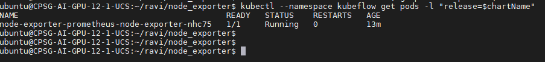

# Resource Monitor

Monitoring usage of Cpu, Gpu and memory with Prometheus and Grafana

* [Prerequisites](#Prerequisites)
* [Setup](#setup)
    * [DCGM EXporter](#dcgmExporter)
    * [NODE EXporter](#nodeExporter)
    * [Prometheus Virtual Service](#prometheusVirtualService)
    * [Grafana](#grafana)
* [Accessing Metrics](#accessingMetrics)
    * [Prometheus](#prometheusDashboard)
    * [Grafana](#grafana)
* [Clean Up](#cleanUp)


## <a name='Prerequisites'></a>Prerequisites

- [ ] Kubernetes Cluster
- [ ] [helm](https://helm.sh/docs/intro/install/)

## <a name='setup'></a>Setup

### <a name='dcgmExporter'></a>DCGM EXporter

Now, we will deploy [dcgm-exporter](https://github.com/NVIDIA/gpu-monitoring-tools) to gather GPU telemetry.

```
kubectl create -f https://raw.githubusercontent.com/prometheus-community/helm-charts/kube-prometheus-stack-9.4.0/charts/kube-prometheus-stack/crds/crd-servicemonitor.yaml
kubectl create -f https://raw.githubusercontent.com/NVIDIA/gpu-monitoring-tools/2.0.0-rc.9/dcgm-exporter.yaml -n kubeflow
kubectl create -f https://raw.githubusercontent.com/NVIDIA/gpu-monitoring-tools/2.0.0-rc.9/service-monitor.yaml -n kubeflow
kubectl patch  ds dcgm-exporter --patch '{"spec": {"template": {"metadata": {"annotations": {"sidecar.istio.io/inject": "false"}}}}}' -n kubeflow
kubectl patch  svc dcgm-exporter --patch '{"metadata": {"annotations":{"prometheus.io/scrape": "true"}}}' -n kubeflow
```
```
kubectl get po -n kubeflow | grep dcgm-exporter
```


### <a name='nodeExporter'></a>Node Exporter

Now, we will deploy `Node Exporter` for hardware and OS metrics using Helm Chart

Once Helm is set up properly, add the repo as follows

```
helm repo add stable https://charts.helm.sh/stable
```

Update the Helm repo

```
helm repo update
```

we can deploy the `Node Exporter` using the `stable/prometheus-node-exporter` chart via Helm

```
helm install node-exporter stable/prometheus-node-exporter --namespace=kubeflow
```

Check Prometheus Node Exporter status by running

```
chartName=`helm ls -n kubeflow | grep node-exporter | head -n1 | awk '{print $1;}'`
kubectl --namespace kubeflow get pods -l "release=$chartName"
```


### <a name='prometheusVirtualService'></a>Prometheus Virtual Service

Create a Prometheus Virtual Service to access Prometheus Dashboard

```
kubectl apply -f prometheus-vs.yaml
```

### <a name='grafana'></a>Grafana

Now, we can deploy `Grafana` to visualize metrics

```
kubectl create -f grafana.yaml
```

## <a name='accessingMetrics'></a>Accessing Metrics

### <a name='prometheusDashboard'></a>Prometheus

* Navigate to the Prometheus UI at http://<INGRESS_IP>:<INGRESS_PORT>/prometheus


* The metrics availability can be verified by typing `DCGM_FI_DEV_GPU_UTIL` in the event bar to determine if the GPU metrics are visible


### <a name='grafana'></a>Grafana

* Navigate to the Grafana Dashboard UI at http://<INGRESS_IP>:<INGRESS_PORT>/istio/grafana/

### DCGM Dashboard

* To access the dashboard, navigate from the Grafana home page to Dashboards -> Manage -> Import


* Copy & Paste the NVIDIA dashboard Json from [NVIDIA_DCGM_Exporter_Dashboard.json](NVIDIA_DCGM_Exporter_Dashboard.json) and click Load.


* choose Prometheus-kubeflow as the data source in the drop down

* Click Import


### Node Exporter Dashboard

* To access the dashboard, navigate from the Grafana home page to Dashboards -> Manage -> Import


* Copy & Paste the Node Exporter dashboard Json from [Node_Exporter_Dashboard.json](Node_Exporter_Dashboard.json) and click Load.


* choose Prometheus-kubeflow as the data source in the drop down

* Click Import


## <a name='cleanUp'></a>Clean Up

Uninstall `prometheus-node-exporter`
```
chartName=`helm ls -n kubeflow | grep node-exporter | head -n1 | awk '{print $1;}'`
helm delete $chartName -n kubeflow
```


Uninstall `DCGM Exporter`
```
kubectl delete -f https://raw.githubusercontent.com/NVIDIA/gpu-monitoring-tools/2.0.0-rc.9/dcgm-exporter.yaml -n kubeflow
kubectl delete -f https://raw.githubusercontent.com/NVIDIA/gpu-monitoring-tools/2.0.0-rc.9/service-monitor.yaml -n kubeflow
```


Uninstall `Grafana`
```
kubectl delete -f grafana.yaml
```
