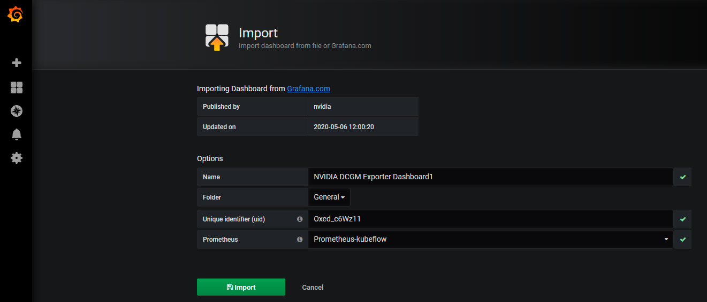

# Resource Monitor

Monitoring usage of Cpu, Gpu and memory with Prometheus and Grafana

* [Prerequisites](#Prerequisites)
* [Setup](#setup)
    * [Prometheus Operator](#prometheusOperator)
    * [DCGM EXporter](#dcgmExporter)
    * [Prometheus Virtual Service](#prometheusVirtualService)
* [Accessing Metrics](#accessingMetrics)
    * [Prometheus](#prometheusDashboard)
    * [Grafana](#grafana)
* [Clean Up](#cleanUp)


## <a name='Prerequisites'></a>Prerequisites

- [ ] Kubernetes Cluster
- [ ] [helm](https://helm.sh/docs/intro/install/)

## <a name='setup'></a>Setup

### <a name='prometheusOperator'></a>Prometheus Operator

Once Helm is set up properly, add the repo as follows

```
helm repo add stable https://charts.helm.sh/stable
```

Update the Helm repo

```
helm repo update
```

we can deploy the `Prometheus` and `Node Exporter` pods using the `prometheus-operator` via Helm

```
helm install stable/prometheus-operator \
    --create-namespace --namespace kubeflow \
    --generate-name \
    --set "prometheus.prometheusSpec.serviceMonitorSelectorNilUsesHelmValues=false"
```

Check Prometheus Operator status by running

```
chartName=`helm ls -n kubeflow | grep prometheus | head -n1 | awk '{print $1;}'`
kubectl --namespace kubeflow get pods -l "release=$chartName"
```


### <a name='dcgmExporter'></a>DCGM EXporter

Now, we will deploy [dcgm-exporter](https://github.com/NVIDIA/gpu-monitoring-tools) to gather GPU telemetry.

```
kubectl create -f https://raw.githubusercontent.com/NVIDIA/gpu-monitoring-tools/2.0.0-rc.9/dcgm-exporter.yaml -n kubeflow
kubectl create -f https://raw.githubusercontent.com/NVIDIA/gpu-monitoring-tools/2.0.0-rc.9/service-monitor.yaml -n kubeflow
```
```
kubectl get po -n kubeflow | grep dcgm-exporter
```


### <a name='prometheusVirtualService'></a>Prometheus Virtual Service

Create a Prometheus Virtual Service to access Prometheus Dashboard

```
kubectl apply -f prometheus-vs.yaml
```
 
## <a name='accessingMetrics'></a>Accessing Metrics

### <a name='prometheusDashboard'></a>Prometheus

* Navigate to the Prometheus UI at http://<INGRESS_IP>:<INGRESS_PORT>/prometheus


* The metrics availability can be verified by typing `DCGM_FI_DEV_GPU_UTIL` in the event bar to determine if the GPU metrics are visible


### <a name='grafana'></a>Grafana

* To open Grafana, enter the following command
```
kubectl port-forward -n istio-system svc/grafana 3000 3000
```
* This starts a local proxy of Grafana on port 3000. For security reasons, the Grafana UI is exposed only within the cluster.
* Navigate to the Grafana UI at http://localhost:3000

### Add a data source

* Before you create your first dashboard, you need to add your data source. Following are the list of instructions to create one.

* Move your cursor to the cog on the side menu which will show you the configuration menu. If the side menu is not visible click the Grafana icon in the upper left corner. Click on Configuration > Data Sources in the side menu and you’ll be taken to the data sources page where you can add and edit data sources. You can also click the cog.
 


* Click Add data source and you will come to the settings page of your new data source


* Select `Prometheus` as data sources type.

* In the Name box, enter a name for this data source and set as default data source.

* In the URL box, enter `prometheus` url.
```
kubectl get svc -l app=prometheus-operator-prometheus -n kubeflow -o jsonpath='{range .items[*]}{.metadata.name}{"\n"}{end}'
```
Expected Output
```
prometheus-operator-161280-prometheus
```


```
Usage: http://<prometheus-svc-name>.<namespace>.svc.cluster.local:9090
Example: http://prometheus-operator-161280-prometheus.kubeflow.svc.cluster.local:9090
```
* Click Save & Test.


### DCGM Dashboard

* To access the dashboard, navigate from the Grafana home page to Dashboards -> Manage -> Import


* Copy & Paste the NVIDIA dashboard Json from [NVIDIA_DCGM_Exporter_Dashboard.json](NVIDIA_DCGM_Exporter_Dashboard.json) and click Load.


* choose Prometheus-kubeflow as the data source in the drop down

* Click Import




### Node Exporter Dashboard

* To access the dashboard, navigate from the Grafana home page to Dashboards -> Manage -> Import


* Copy & Paste the Node Exporter dashboard Json from [Node_Exporter_Dashboard.json](Node_Exporter_Dashboard.json) and click Load.


* choose Prometheus-kubeflow as the data source in the drop down

* Click Import


## <a name='cleanUp'></a>Clean Up

Uninstall `Prometheus-operator`
```
chartName=`helm ls -n kubeflow | grep prometheus | head -n1 | awk '{print $1;}'`
helm delete $chartName -n kubeflow
```


Uninstall `DCGM Exporter`
```
kubectl delete -f https://raw.githubusercontent.com/NVIDIA/gpu-monitoring-tools/2.0.0-rc.9/dcgm-exporter.yaml -n kubeflow
kubectl delete -f https://raw.githubusercontent.com/NVIDIA/gpu-monitoring-tools/2.0.0-rc.9/service-monitor.yaml -n kubeflow
```


