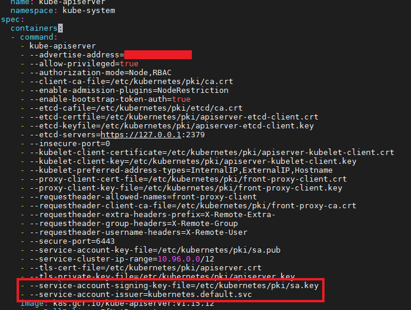
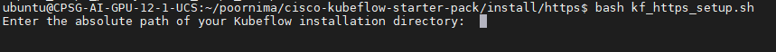

# **Kubeflow v1.1.0 Setup on UCS**

This manual guides you through the installation of Kubeflow v1.1.0 in a detailed manner.

## **Infrastructure**

Either of the following infrastructure can be used for KF implementation:

* Cisco Unified Computing System(UCS) - C240M5 
* Cisco UCS - C480ML

## **Prerequisites**

* Kubernetes v1.15.x
* Default Kubernetes storage class that can dynamically provision volumes

## [Internal] **Prerequisites Reference setup**
[This](k8_setup.md) is a reference guide for creating a test Kubernetes cluster with a dynamic storage class.

Note: This is not part of the kubeflow-starter-pack. It is meant for internal development and testing. This serves as a reference for kubeflow-starter-pack users and not recommended as a golden path for setting up prerequisites.

## **Kubernetes customization**

Before installing Kubeflow v1.1.0, please update the necessary configurations for ```kubeadm``` created clusters as detailed below. 

- Change directory to ```/etc/kubernetes/manifests``` path.

    ```
    #Gain admin privileges to the node
    sudo -i

    #Change directory
    cd /etc/kubernetes/manifests
    ```
- Edit ```kube-apiserver.yaml``` to add the following configuration under the ```command:``` tag as shown:

    ```
    - --service-account-signing-key-file=/etc/kubernetes/pki/sa.key
    - --service-account-issuer=kubernetes.default.svc
    ```
    


## **Kubeflow Installation**

*Version* : *Kubeflow v1.1.0*

*Flavour* : *Multi-user, auth-enabled with kfctl_istio_dex*

*Kubeflow manifests release tag URL* : *https://github.com/kubeflow/manifests/tree/v1.1-branch*

*kfctl release tag URL* : *https://github.com/kubeflow/kfctl/tree/v1.1-branch*

### **Procedure**

Install Kubeflow v1.1.0 following the steps below:

* Export ```INGRESS_IP``` variable and execute ```kubeflow.bash``` script.

   ```
   export INGRESS_IP=<<UCS's Machine IP>>
   bash kubeflow.bash
   ```

* Ensure whether Kubeflow and all it's core components are running successfully.

   ```
   kubectl get pods --all-namespaces
   ```
***Expected Output:***

   ```
   NAMESPACE            NAME                                                         READY   STATUS      RESTARTS   AGE
    auth                 dex-fbc9fbff4-chhqt                                          1/1     Running     1          4m50s
    cert-manager         cert-manager-5bb6f6d6ff-nwkm8                                1/1     Running     0          5m14s
    cert-manager         cert-manager-cainjector-5b97fdb664-f9ks4                     1/1     Running     0          5m14s
    cert-manager         cert-manager-webhook-55d698bc9f-dfmmx                        1/1     Running     2          5m14s
    istio-system         authservice-0                                                1/1     Running     0          4m51s
    istio-system         cluster-local-gateway-f4967d447-mzs5v                        1/1     Running     0          5m15s
    istio-system         istio-citadel-79b5b568b-4464l                                1/1     Running     0          5m20s
    istio-system         istio-galley-756f5f45c4-g8qnd                                1/1     Running     0          5m20s
    istio-system         istio-ingressgateway-77f74c944c-fdl57                        1/1     Running     0          5m20s
    istio-system         istio-nodeagent-n6wfn                                        1/1     Running     0          5m19s
    istio-system         istio-pilot-55f7f6f6df-s2g85                                 2/2     Running     0          5m20s
    istio-system         istio-policy-76dbd68445-x9k5p                                2/2     Running     4          5m19s
    istio-system         istio-security-post-install-release-1.3-latest-daily-wkzm5   0/1     Completed   0          5m19s
    istio-system         istio-sidecar-injector-5d9f474dcb-hnzgq                      1/1     Running     0          5m19s
    istio-system         istio-telemetry-697c8fd794-qg2ln                             2/2     Running     4          5m19s
    istio-system         prometheus-b845cc6fc-v94j5                                   1/1     Running     0          5m19s
    knative-serving      activator-6df8b74b8-8gt6l                                    1/1     Running     0          4m38s
    knative-serving      autoscaler-7f846944cf-btdr2                                  1/1     Running     0          4m38s
    knative-serving      autoscaler-hpa-d67f7757f-98khm                               1/1     Running     0          4m38s
    knative-serving      controller-57fd956f47-hqkch                                  1/1     Running     0          4m38s
    knative-serving      networking-istio-54849c5c87-7s8nx                            1/1     Running     0          4m38s
    knative-serving      webhook-58596d5677-426q5                                     1/1     Running     0          4m37s
    kube-system          calico-kube-controllers-758d7b8fd-8tq7j                      1/1     Running     0          126m
    kube-system          calico-node-z8h6m                                            1/1     Running     0          126m
    kube-system          coredns-5d4dd4b4db-frhq6                                     1/1     Running     0          127m
    kube-system          coredns-5d4dd4b4db-lb7hw                                     1/1     Running     0          127m
    kube-system          etcd-cpsg-ai-gpu-12-1-ucs                                    1/1     Running     0          127m
    kube-system          kube-apiserver-cpsg-ai-gpu-12-1-ucs                          1/1     Running     0          6m26s
    kube-system          kube-controller-manager-cpsg-ai-gpu-12-1-ucs                 1/1     Running     0          127m
    kube-system          kube-proxy-4gqd2                                             1/1     Running     0          127m
    kube-system          kube-scheduler-cpsg-ai-gpu-12-1-ucs                          1/1     Running     0          127m
    kube-system          nvidia-device-plugin-daemonset-4bfcq                         1/1     Running     0          125m
    kubeflow             admission-webhook-bootstrap-stateful-set-0                   1/1     Running     0          4m50s
    kubeflow             admission-webhook-deployment-795bb748-hvh9z                  1/1     Running     0          4m43s
    kubeflow             application-controller-stateful-set-0                        1/1     Running     0          5m24s
    kubeflow             argo-ui-657d964995-92vrm                                     1/1     Running     0          4m45s
    kubeflow             cache-deployer-deployment-867cf86c64-dls9d                   2/2     Running     3          4m45s
    kubeflow             cache-server-65596854d-mvzr5                                 2/2     Running     0          4m45s
    kubeflow             centraldashboard-54c547bd7f-gfxn7                            1/1     Running     0          4m45s
    kubeflow             jupyter-web-app-deployment-56dc859fdd-9dpt2                  1/1     Running     0          4m45s
    kubeflow             katib-controller-6fc96fddf8-fvcm9                            1/1     Running     1          4m45s
    kubeflow             katib-db-manager-78d458db46-mwll9                            1/1     Running     1          4m45s
    kubeflow             katib-mysql-7f9cfccb98-m4dwr                                 1/1     Running     0          4m45s
    kubeflow             katib-ui-74768457d5-8ckfk                                    1/1     Running     0          4m44s
    kubeflow             kfserving-controller-manager-0                               2/2     Running     0          4m31s
    kubeflow             kubeflow-pipelines-profile-controller-588884d9bb-5cdh6       1/1     Running     0          4m44s
    kubeflow             metacontroller-0                                             1/1     Running     0          4m51s
    kubeflow             metadata-db-7fc598bbb5-9575m                                 1/1     Running     0          4m44s
    kubeflow             metadata-deployment-7578c6bc46-7sv6p                         1/1     Running     4          4m44s
    kubeflow             metadata-envoy-deployment-75df6688bb-p7dkw                   1/1     Running     0          4m44s
    kubeflow             metadata-grpc-deployment-76d44cfd88-xvr25                    1/1     Running     4          4m43s
    kubeflow             metadata-ui-794f6dcc5b-mxncn                                 1/1     Running     0          4m43s
    kubeflow             metadata-writer-694c48ccdc-s4gh8                             2/2     Running     0          4m43s
    kubeflow             minio-655ddb4d95-mmfqz                                       1/1     Running     0          4m43s
    kubeflow             ml-pipeline-5df444d46d-kz99h                                 2/2     Running     0          4m43s
    kubeflow             ml-pipeline-persistenceagent-9f5c875d-tgvwd                  2/2     Running     0          4m43s
    kubeflow             ml-pipeline-scheduledworkflow-768c4d65d4-s5m24               2/2     Running     0          4m42s
    kubeflow             ml-pipeline-ui-8589d58598-hb679                              2/2     Running     0          4m42s
    kubeflow             ml-pipeline-viewer-crd-5dd6cc5f56-jw4kw                      2/2     Running     4          4m42s
    kubeflow             ml-pipeline-visualizationserver-9b67b8b68-6zjnw              2/2     Running     0          4m42s
    kubeflow             mpi-operator-55457d5f54-zr9hb                                1/1     Running     0          4m42s
    kubeflow             mxnet-operator-68bf5b4fbc-4fwst                              1/1     Running     0          4m42s
    kubeflow             mysql-56f64cfcc-kks96                                        2/2     Running     0          4m41s
    kubeflow             notebook-controller-deployment-6f789d748-2shjv               1/1     Running     0          4m41s
    kubeflow             profiles-deployment-6fffd9c9-rpfqt                           2/2     Running     0          4m41s
    kubeflow             pytorch-operator-d449c769b-kgwtf                             1/1     Running     0          4m41s
    kubeflow             seldon-controller-manager-68f9f7bff6-xhc6l                   1/1     Running     0          4m41s
    kubeflow             spark-operatorsparkoperator-758795c89b-ljcx7                 1/1     Running     0          4m50s
    kubeflow             tf-job-operator-644f847f5c-w2rl4                             1/1     Running     0          4m40s
    kubeflow             workflow-controller-dd8985f4d-42vd7                          1/1     Running     0          4m40s
    local-path-storage   local-path-provisioner-7d78476b7f-hmrs8                      1/1     Running     0          125m
```

## **Secure Kubeflow**

The connection with Kubeflow Central dashboard can be done securely through HTTPS.

### **Setup**

- Listed below are the steps performed to access Kubeflow through HTTPS protocol for your reference.

  * Exposing the port 443 with HTTPS by updating the Istio's      gateway object in Kubeflow namespace.
  * Creating a self-signed certificate and a configmap for storing the ingress gateway self-signed certificate parameters by applying required YAML configurations using [kustomize](https://kustomize.io/).

- To perform the above mentioned steps, please execute the script ```kf_https_setup.sh``` using the following command:

```
bash kf_https_setup.sh
```
Enter the absolute path of the Kubeflow installation folder when prompted as shown below:



- Connect to Kubeflow's Central dashboard securely using the following URL.

```
https://<INGRESS_IP>:31390
```

## **References**

* https://www.kubeflow.org/docs/started/k8s/kfctl-istio-dex/


