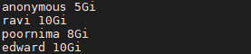
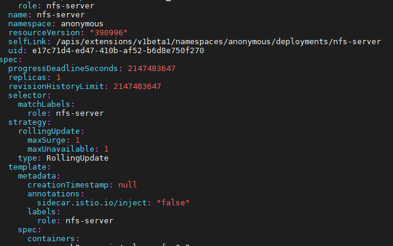

<h1 align="center">NFS installation on Kubeflow v1.1</h1>


This manual will guide you to install and setup NFS to be used on Kubeflow v1.1 installed UCS machine. Generally NFS are used to share data between different K8s objects. They are useful during Kubeflow pipeline executions.

## Prerequisites

* K8s & Kubeflow v1.1 installed.

**Note:** Please refer [here](../) to install prerequisites.
## NFS installation

The NFS installation script performs the tasks as listed below:

 * Profile/Namespace creation for every user
 * NFS server deployment creation
 * Persistent Volume(PV) & Persistent Volume Claim(PVC) creation
 * User credentials integration with Dex auth as static users
        
### Procedure

* Install the apt package to install NFS server on the machine.

  ```
  sudo apt install nfs-kernel-server
  ```

* Add the inputs corresponding to desired users/profiles to the ```users.txt``` file. Note that each user will represent a separate namespace each. The inputs will be user/profile name and PVC storage request as shown below.

     

* Execute ```nfs_install_user_ns.sh``` script to create users, add them to Dex auth, create NFS-server, PV & PVC for respective users.

```
bash nfs_install_user_ns.sh
```

Once executed, you will be prompted to enter mail ID and password for every user being created. This will be added to Dex auth configmap with the password encrypted using Bcrypt.

## NFS PV & PVC utilisation procedure

On successful execution of the nfs installation script, namespaces and corresponding NFS servers, PVs and PVCs will be created.

To enable successful utilization of the created PVC such as mounting the PVC to pods, please add the following yaml configuration to ```nfs-server``` deployment spec under ```spec:``` -> ```template:``` of the specific namespace.

```
annotations:
        sidecar.istio.io/inject: "false"
```

To find & edit ```nfs-server``` deployment, use:

```
kubectl get nfs-server -n <<namespace>> | grep nfs-server
kubectl edit deployment nfs-server -n <<namespace>>
```
Press ```:wq``` once done with editing.




## References:

To know more about Kubernetes profiles:
   
   - https://v1-1-branch.kubeflow.org/docs/components/multi-tenancy/getting-started/
